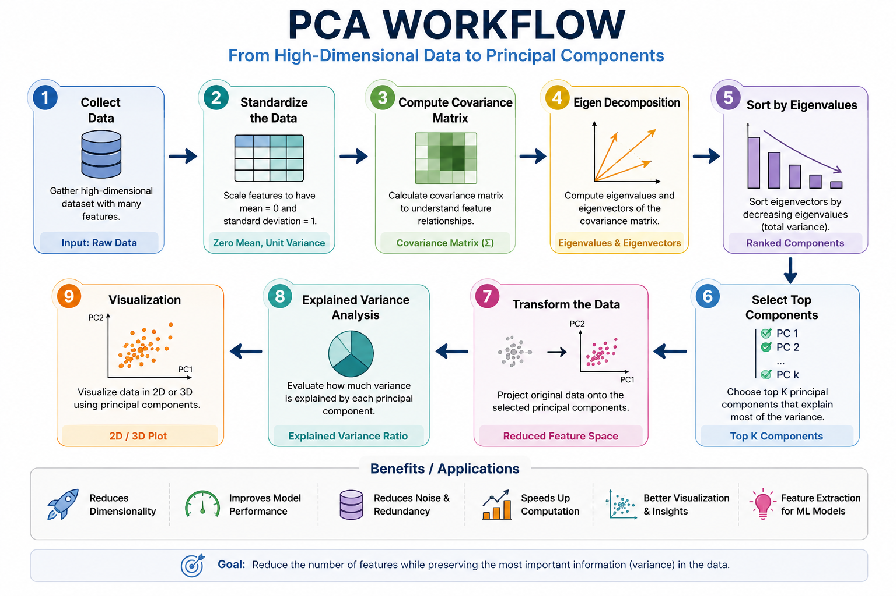

# IBM PCA - Dimensionality Reduction

A complete implementation of Principal Component Analysis (PCA) using Python and Scikit-learn.

This project demonstrates how PCA reduces high-dimensional data into fewer dimensions while preserving the maximum amount of information.

---

# Project Overview

Principal Component Analysis (PCA) is one of the most popular dimensionality reduction techniques used in Machine Learning.

In this project you will learn:

- What PCA is
- Why PCA is used
- How PCA works
- Explained Variance
- Principal Components
- Data Visualization
- Noise Reduction
- Feature Extraction

---

# Workflow



---

# Repository Structure

```
IBM-PCA-Dimensionality-Reduction
│
├── images/
│   └── pca-workflow.png
│
├── results/
│
├── PCA_Lab.ipynb
├── PCA_Notes.md
├── requirements.txt
├── README.md
├── LICENSE
└── .gitignore
```

---

# Installation

```bash
pip install -r requirements.txt
```

---

# Technologies Used

- Python
- NumPy
- Pandas
- Matplotlib
- Scikit-learn
- PCA

---

# Learning Outcomes

After completing this project you will understand:

- Principal Component Analysis (PCA)
- Feature Extraction
- Dimensionality Reduction
- Explained Variance
- Data Projection
- Noise Reduction

---

# Future Improvements

- Apply PCA on larger datasets
- Compare PCA with t-SNE
- Compare PCA with UMAP
- Build visualization dashboard

---

# Author

**Hamza**

Learning Machine Learning one project at a time.
